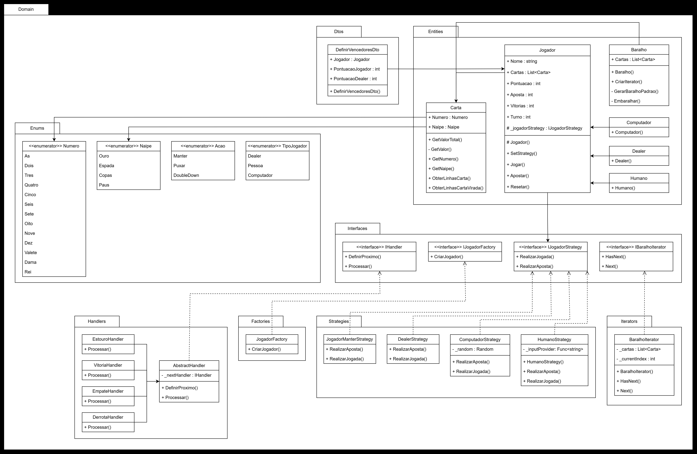

# CardGame

**Disciplina:** Design Patterns  
**Linguagem:** C#  
**Objetivo:** Desenvolver um jogo de Blackjack (21) em console, aplicando diferentes padrões de projeto. Este projeto foi criado para demonstrar a aplicação prática de **Design Patterns**, priorizando flexibilidade, escalabilidade e organização do código.

## Descrição

O **CardGame** é um jogo de Blackjack implementado em console. Ele utiliza vários padrões de projeto para resolver problemas comuns de desenvolvimento e garantir uma arquitetura sólida. Além de seu propósito educacional, o jogo oferece uma experiência interativa, permitindo que jogadores enfrentem o dealer e outros competidores controlados pelo computador.

## Regras Básicas do Blackjack

1. Cada jogador começa com duas cartas.
2. O objetivo é alcançar uma pontuação o mais próximo possível de 21, sem ultrapassá-la.
3. O Ás pode valer 1 ou 11, dependendo do contexto (implementado com **Strategy**).
4. O jogador pode optar por comprar mais cartas ("hit") ou "parar" a qualquer momento.
5. O dealer deve continuar comprando cartas até atingir, no mínimo, 17 pontos.
6. O jogador pode dobrar a aposta depois de receber as duas primeiras cartas. O jogador recebe uma única carta adicional e sua aposta é duplicada. Se o jogador vencer, ele recebe o dobro da aposta, caso contrário, perde a aposta dobrada.
7. O jogo termina com vitória, derrota, empate ou estouro, determinados por uma cadeia de validações.

## Padrões de Projeto Utilizados

### 1. **Factory**
Facilita a criação de objetos como jogadores (Dealer, computador e o jogador humano).  
**Exemplo:** A classe `JogadorFactory` encapsula a lógica de instanciar diferentes tipos de jogadores.

### 2. **Iterator**
Gerencia a iteração eficiente sobre o baralho, garantindo que as cartas sejam distribuídas na sequência correta enquanto mantém o estado interno do baralho.

### 3. **Strategy**
Resolve as apostas e jogadas de cada jogador, permitindo alterar a lógica de jogo.  
**Exemplo:** O strategy `JogadorManter` é válido para todos os jogadores e encerra a compra de cartas durante a rodada.

### 4. **Chain of Responsibility**
Este padrão organiza as validações do estado do jogo (vitória, derrota, empate ou estouro) em uma cadeia de responsabilidades. Cada handler verifica uma condição específica e, se aplicável, processa o resultado antes de delegar para o próximo.

**Exemplo:**  
A cadeia de validações inclui:
- Verificar se o jogador "estourou" (pontuação > 21).
- Determinar vitória ou derrota ao comparar as pontuações.
- Resolver empates.

## Diagrama UML



---

## Análise dos Problemas Detectados

- Código acoplado e com responsabilidades misturadas na camada Presentation.
- Falta de abstração da lógica de jogo, dificultando testes e manutenção.
- Uso inconsistente de encapsulamento e práticas inseguras (ex.: uso de `Random`).
- Falta de padronização no estilo e nomenclatura.

---

## Estratégia de Refatoração

- Separação clara das camadas: Presentation, Application e Domain.
- Criação de interfaces para abstração da lógica de jogo (`IGameService`).
- Extração da lógica de jogo do console para serviço testável.
- Substituição do `Random` por `RandomNumberGenerator` para segurança e previsibilidade.
- Introdução de testes unitários cobrindo o novo projeto Application.
- Organização do código para facilitar manutenção e extensibilidade.

---

## Testes Implementados

- Suíte de testes unitários para `GameService`.
- Cobertura dos métodos principais: criação de jogadores, apostas, distribuição de cartas, avaliação de vencedores e estado da mesa.
- Uso de mocks para simular entradas e garantir isolamento dos testes.

---

## Estilização e Linter

Este projeto usa `dotnet-format` para garantir consistência na formatação de código:
```bash
dotnet tool install -g dotnet-format
dotnet format
```
---

## Instalação e Execução

1. Clone o repositório:
   ```bash
   git clone https://github.com/GuiDalmolin/clean-code-card-game.git
   cd CardGame
   ```
2. Abra o projeto no Visual Studio ou VS Code.
3. Compile e execute o projeto principal (CardGame.Presentation).
4. Execute os testes com o comando:
    ```bash
    dotnet test Tests/
    ```
